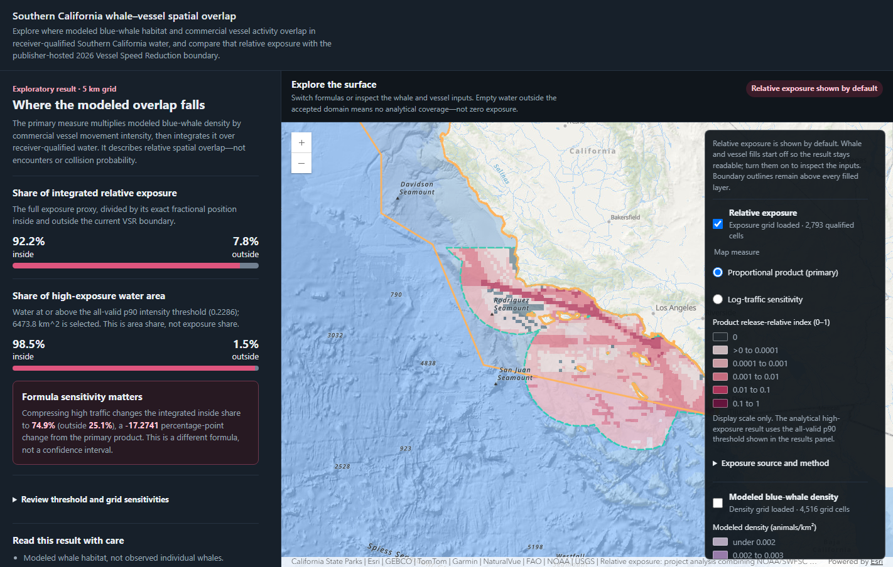

# Southern California whale–vessel spatial overlap

An exploratory GIS analysis of where modeled blue-whale habitat overlaps with
commercial vessel activity off Southern California, and how that relative
exposure falls inside versus outside the current California Vessel Speed
Reduction (VSR) zone.

> **[Open the live interactive map](https://socal-whale-vessel-overlap.vercel.app/)**
>
> The existing site is public and verified. Version 1 release preparation is in
> progress: a corrected review/acceptance sentence is merged but is not yet in a
> new authorized production release. The map and results shown below describe
> the current deployed build; see [Project status](#project-status).

## The question

> Where does modeled blue-whale habitat overlap with commercial vessel activity
> off Southern California, and how much of that relative exposure occurs inside
> versus outside the current VSR zone?

The project answers that question with a reproducible Python analysis and a
browser-based map. It is a portfolio project for examining spatial reasoning,
data lineage, analytical choices, and scientific communication—not a
navigational, regulatory, or vessel-operations tool.

## What the application does

The application displays five coordinated layers: modeled blue-whale density,
commercial vessel activity, the resulting relative-exposure surface, the
receiver-qualified analytical-domain boundary, and the publisher-hosted 2026
VSR boundary. A results panel reports inside/outside shares and keeps the
formula, threshold, grid-resolution, source-vintage, and coverage sensitivities
within reach.

Visitors can:

- compare the primary proportional-product surface with the materially
  different log-traffic sensitivity;
- turn the whale and vessel inputs on to interpret the combined result;
- inspect exact 5 km cells and their source values;
- distinguish integrated exposure share from high-exposure water-area share;
- see cells outside the accepted domain as excluded, not as low or zero
  traffic; and
- read limitations, source dates, units, attribution, and the VSR
  non-navigational disclaimer in the interface.

## Headline findings

For the primary 5 km proportional-product result, **92.2% of integrated
relative exposure falls inside the 2026 VSR boundary and 7.8% falls outside**.
This is the exposure proxy integrated over exact receiver-qualified water and
partitioned by each cell's fractional position across the boundary.

That statistic is different from the **share of high-exposure water area**.
Using the all-valid p90 intensity threshold, 6,473.8 km² of qualified water is
selected; **98.5% of that area is inside and 1.5% is outside**. Area share does
not measure how much integrated exposure those cells contribute.

The finding is sensitive to the formula. Compressing vessel activity with the
required log-traffic sensitivity changes the integrated split to **74.9%
inside and 25.1% outside**, a **−17.2741 percentage-point** change in the inside
share from the primary product. This is a different analytical formula, not a
confidence interval. The product result is therefore the selected exploratory
answer, not a formula-robust estimate.

These numbers were generated in
[`results/exposure-results.v1.json`](results/exposure-results.v1.json),
reconciled against the analytical tables, independently reviewed for
exploratory public presentation, author-accepted with the recorded
limitations, reproduced during M8, and matched to the deployed package. They
describe **relative spatial overlap**, not collision probability, observed
whale–vessel encounters, causal VSR effectiveness, or an optimal boundary.

## What the inputs mean

- **Whales:** NOAA/SWFSC's 2020b multi-year summer–fall blue-whale density
  model, based on survey years from 1991–2018. These are modeled density
  estimates, not observed whale locations.
- **Vessels:** NOAA/USCG AIS from 1 July through 30 November 2024 for commercial
  type codes 60–89, with no vessel-length filter. Transfer completeness and
  observational completeness remain unverified; AIS attributes are not all
  independently observed.
- **VSR context:** the publisher's current 2026 voluntary California boundary,
  displayed directly as `FID = 126`. Analysis used an immutable local snapshot
  retrieved 25 August 2026; the project does not host or redistribute that
  geometry.
- **Analytical domain:** modeled-whale-support water within 50 nautical miles
  (92,600 m) of relevant NAIS reception stations. This is a
  system-performance-qualified receiver domain—not empirical 2024 AIS coverage
  and not a coastal buffer.

The mixed vintages are intentional and visible: the analysis compares the
multi-year whale model and July–November 2024 traffic with the current 2026 VSR
context. It does not claim that the inputs are contemporaneous.

## Method and architecture

Python validates and transforms the source data, builds a 5 km California
Albers grid, transfers modeled whale abundance by area weighting, aggregates
accepted vessel movement as vessel-kilometres, and calculates exposure. The
primary cell intensity is modeled whale density multiplied by vessel-activity
intensity; exact qualified and VSR-intersection areas are then used for
integration. Vessel speed is reported separately rather than used in the
exposure index.

QGIS supplies required checksum-bound visual inspection of exact spatial
outputs; it is not a production transformation step. A static Next.js and
TypeScript application uses the ArcGIS Maps SDK for JavaScript to present
precomputed results. Project-derived layers are checksum-addressed static files
served with the application on Vercel; the browser loads the VSR boundary from
the publisher's ArcGIS service. There is no custom backend, database, live AIS
feed, or browser-side exposure calculation.



*Current deployed build captured from the public application on 11 September
2026; results generated 7 September 2026 from the accepted 2024 traffic period,
multi-year whale model, and 2026 VSR context. Esri and source attribution remain
visible in the image. The capture does not show the merged but not-yet-deployed
review/acceptance wording correction.*

## Run and reproduce

To inspect the application source without reconstructing the analytical data:

```powershell
cd web
npm ci
$env:NEXT_PUBLIC_ARCGIS_BASEMAP = "topo-vector"
npm run dev
```

The keyless basemap path is suitable for local source inspection and displays a
configuration notice; it is not production-key evidence. The generated project
layer files are intentionally ignored and are **not included in a clone**, so a
repository-only local run cannot reproduce the complete deployed map. The
tracked application-results JSON is a build input, not a public endpoint.

For the Python checks:

```powershell
cd analysis
python -m uv sync --locked
python -m uv lock --check
python -m uv run pytest
```

Full analytical reproduction requires the author-supplied, Git-ignored source
data and retained immutable inputs. Follow the exact resource gates and ordered
procedures in the [analysis guide](analysis/README.md); do not treat the test
suite as a raw-to-results run. Source retrieval, local storage, and provenance
are documented separately in the [source register](docs/data-sources.md) and
[data policy](data/README.md). Any ArcGIS browser key belongs only in ignored
`web/.env.local`, must be origin-restricted and minimally scoped, and must never
carry publishing or account-management privileges.

## Documentation

- [Project brief](docs/project-brief.md) — authoritative Version 1 scope,
  non-goals, and scientific framing
- [Roadmap](docs/roadmap.md) — milestone criteria and current status
- [Analysis guide](analysis/README.md) — processing contracts, commands,
  resource gates, and exact analytical evidence
- [Web guide](web/README.md) — application behavior and display contracts
- [Architecture](docs/architecture.md) — system boundaries and data flow
- [Data sources](docs/data-sources.md) — provenance, versions, source-use
  posture, and unresolved source facts
- [Local data policy](data/README.md) — ignored data layout, retrieval rules,
  and the VSR no-copy policy
- [Development and release process](docs/development.md) — testing, secrets,
  release staging, authorization, deployment, and rollback
- [Architecture decisions](docs/decisions/README.md) — accepted choices and
  rationale
- [M8 verification handoff](docs/m8-verification-handoff.md) — retained
  end-to-end reproduction and audit evidence
- [M9 release-preparation handoff](docs/m9-release-preparation-handoff.md) —
  current release-readiness review and remaining gates

## Project status

M1–M6 and M8 are complete. M7 remains in progress until the corrected
review/acceptance wording is included in a reviewed, explicitly authorized
production release and verified at the public origin. M9 is in progress through
this portfolio-documentation and release-readiness branch; neither M9 nor
Version 1 is declared complete or fully released here. The existing application
remains live at the stable URL above.

The repository currently has no declared project license. Source data and
third-party services retain their own terms; in particular, VSR redistribution
permission is unconfirmed and the project's no-copy rule remains in force. A
project-license decision requires author approval.
